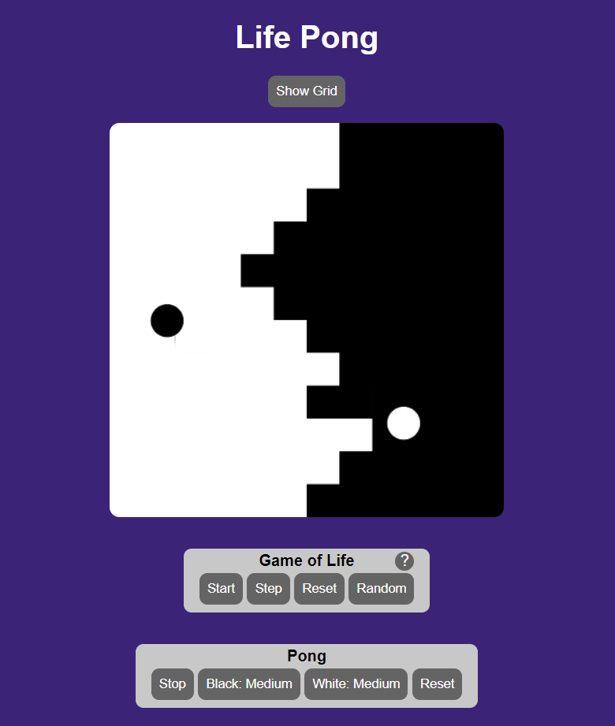

# Life Pong

A combination of the game of life with a neat little application that I saw in a tweet (linked below)

[try it in your browser!](https://jteitelb.github.io/life-pong/)

started out trying to recreate a small app from a tweet:

[the post that inspired me](https://twitter.com/vnglst/status/1751278052154179770?t=aEY-nyBzjO4Sp0JI5tA7bA)

[the post that inspired the post that inspired me](https://twitter.com/nicolasdnl/status/1749715070928433161)

learn to make games with the Canvas API:
https://dev.to/zippcodder/complete-guide-to-building-games-in-the-browser-kp6
